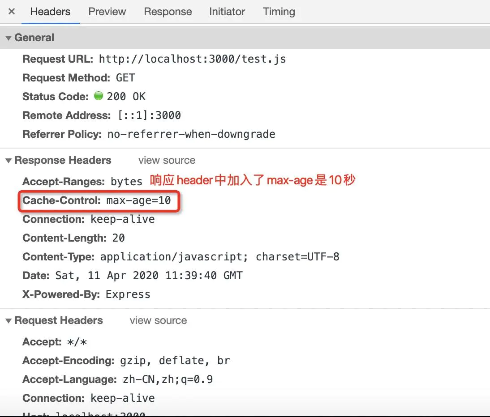
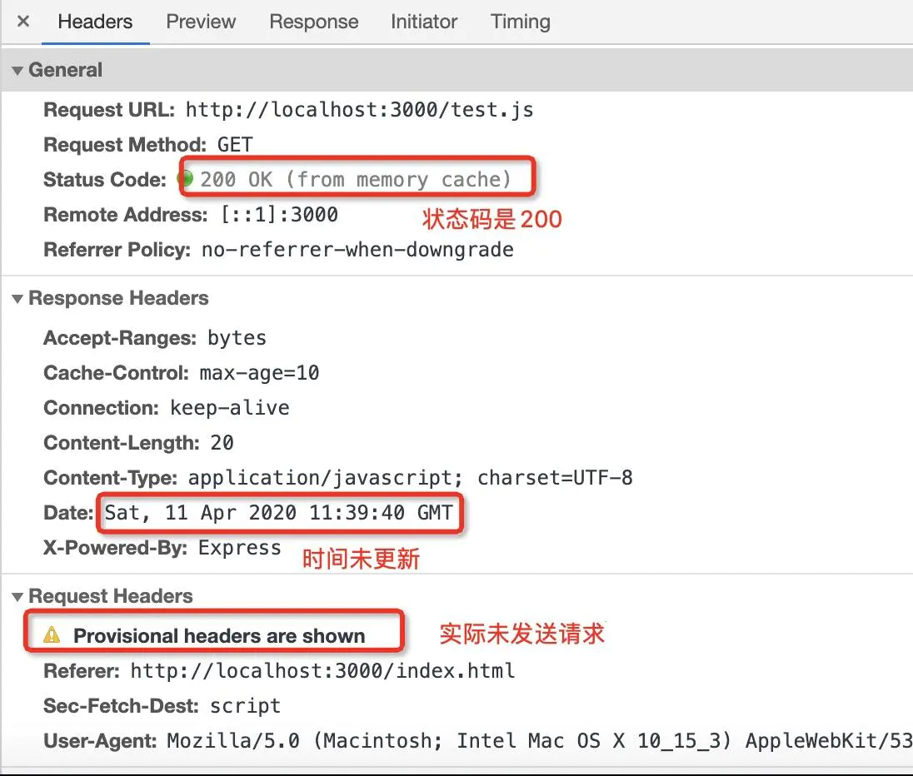
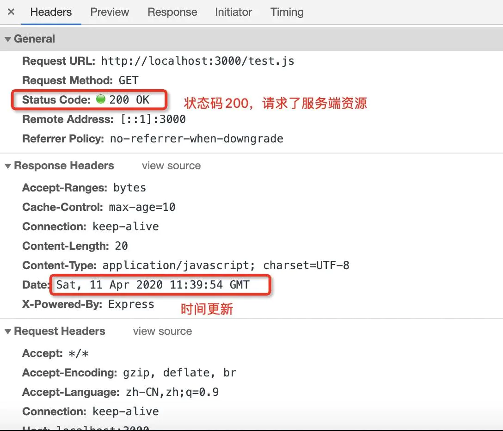
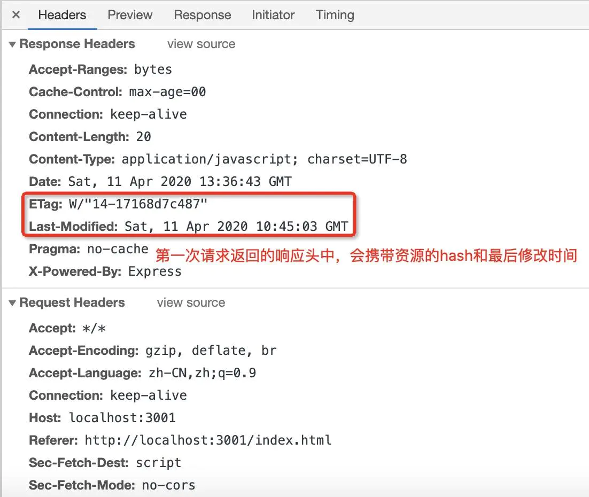
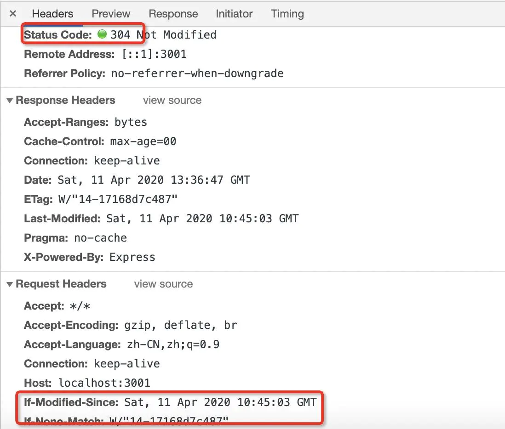
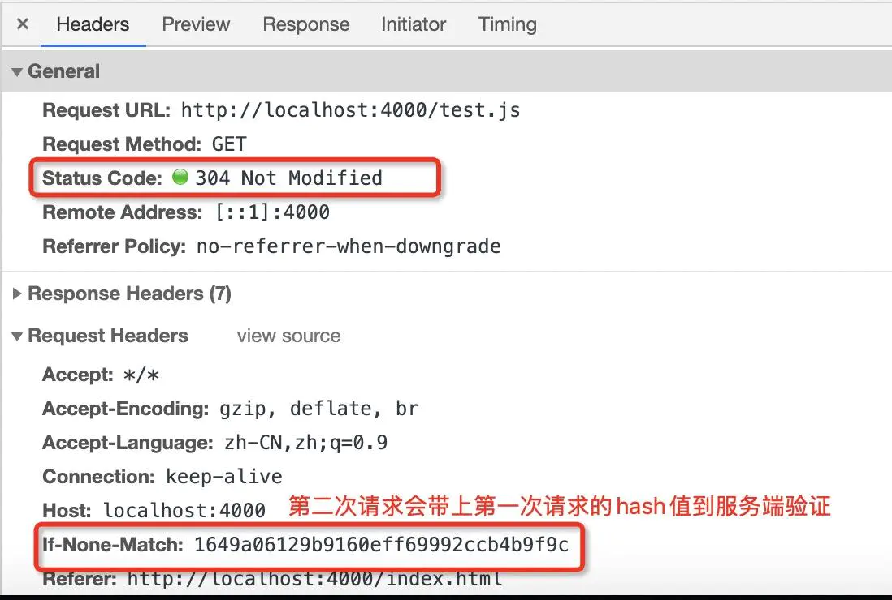
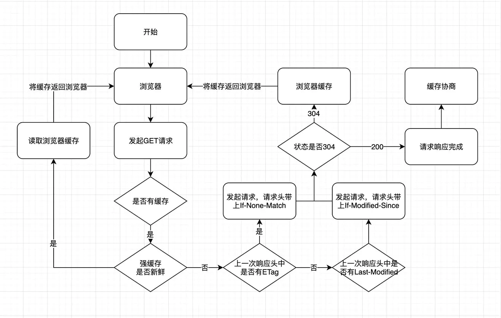

# 图解 HTTP 缓存

>作者：政采云前端团队
# 前言

HTTP 的缓存机制，可以说这是前端工程师需要掌握的重要知识点之一。本文将针对 HTTP 缓存整体的流程做一个详细的讲解，争取做到大家读完整篇文章后，对缓存有一个整体的了解。

HTTP 缓存分为 2 种，一种是强缓存，另一种是协商缓存。主要作用是可以加快资源获取速度，提升用户体验，减少网络传输，缓解服务端的压力。这是缓存运作的一个整体流程图：


## 强缓存

不需要发送请求到服务端，直接读取浏览器本地缓存，在 Chrome 的 Network 中显示的 HTTP 状态码是 200 ，在 Chrome 中，强缓存又分为 Disk Cache (存放在硬盘中)和 Memory Cache (存放在内存中)，存放的位置是由浏览器控制的。是否强缓存由 Expires、Cache-Control 和 Pragma 3 个 Header 属性共同来控制。

### ○ Expires

Expires 的值是一个 HTTP 日期，在浏览器发起请求时，会根据系统时间和 Expires 的值进行比较，如果系统时间超过了 Expires 的值，缓存失效。由于和系统时间进行比较，所以当系统时间和服务器时间不一致的时候，会有缓存有效期不准的问题。Expires 的优先级在三个 Header 属性中是最低的。

### ○ Cache-Control

Cache-Control 是 HTTP/1.1 中新增的属性，在请求头和响应头中都可以使用，常用的属性值如有：

* max-age：单位是秒，缓存时间计算的方式是距离发起的时间的秒数，超过间隔的秒数缓存失效
* no-cache：不使用强缓存，需要与服务器验证缓存是否新鲜
* no-store：禁止使用缓存（包括协商缓存），每次都向服务器请求最新的资源
* private：专用于个人的缓存，中间代理、CDN 等不能缓存此响应
* public：响应可以被中间代理、CDN 等缓存
* must-revalidate：在缓存过期前可以使用，过期后必须向服务器验证

### ○ Pragma

Pragma 只有一个属性值，就是 no-cache ，效果和 Cache-Control 中的 no-cache 一致，不使用强缓存，需要与服务器验证缓存是否新鲜，在 3 个头部属性中的优先级最高。

本地通过 express 起一个服务来验证强缓存的 3 个属性，代码如下：

```javascript
const express = require('express');
const app = express();
var options = { 
  etag: false, // 禁用协商缓存
  lastModified: false, // 禁用协商缓存
  setHeaders: (res, path, stat) => {
    res.set('Cache-Control', 'max-age=10'); // 强缓存超时时间为10秒
  },
};
app.use(express.static((__dirname + '/public'), options));
app.listen(3000);
```

第一次加载，页面会向服务器请求数据，并在 Response Header 中添加 Cache-Control ，过期时间为 10 秒。


第二次加载，Date 头属性未更新，可以看到浏览器直接使用了强缓存，实际没有发送请求。



过了 10 秒的超时时间之后，再次请求资源：



当 Pragma 和 Cache-Control 同时存在的时候，Pragma 的优先级高于 Cache-Control。


## 协商缓存

当浏览器的强缓存失效的时候或者请求头中设置了不走强缓存，并且在请求头中设置了If-Modified-Since 或者 If-None-Match 的时候，会将这两个属性值到服务端去验证是否命中协商缓存，如果命中了协商缓存，会返回 304 状态，加载浏览器缓存，并且响应头会设置 Last-Modified 或者 ETag 属性。

### ○ ETag/If-None-Match

ETag/If-None-Match 的值是一串 hash 码，代表的是一个资源的标识符，当服务端的文件变化的时候，它的 hash码会随之改变，通过请求头中的 If-None-Match 和当前文件的 hash 值进行比较，如果相等则表示命中协商缓存。ETag 又有强弱校验之分，如果 hash 码是以 "W/" 开头的一串字符串，说明此时协商缓存的校验是弱校验的，只有服务器上的文件差异（根据 ETag 计算方式来决定）达到能够触发 hash 值后缀变化的时候，才会真正地请求资源，否则返回 304 并加载浏览器缓存。

### ○ Last-Modified/If-Modified-Since

Last-Modified/If-Modified-Since 的值代表的是文件的最后修改时间，第一次请求服务端会把资源的最后修改时间放到 Last-Modified 响应头中，第二次发起请求的时候，请求头会带上上一次响应头中的 Last-Modified 的时间，并放到 If-Modified-Since 请求头属性中，服务端根据文件最后一次修改时间和 If-Modified-Since 的值进行比较，如果相等，返回 304 ，并加载浏览器缓存。

本地通过 express 起一个服务来验证协商缓存，代码如下：

```javascript
const express = require('express');
const app = express();
var options = { 
  etag: true, // 开启协商缓存
  lastModified: true, // 开启协商缓存
  setHeaders: (res, path, stat) => {
    res.set({
      'Cache-Control': 'max-age=00', // 浏览器不走强缓存
      'Pragma': 'no-cache', // 浏览器不走强缓存
    });
  },
};
app.use(express.static((__dirname + '/public'), options));
app.listen(3001);
```

第一次请求资源:



第二次请求资源，服务端根据请求头中的 If-Modified-Since 和 If-None-Match 验证文件是否修改。



我们再来验证一下 ETag 在强校验的情况下，只增加一行空格，hash 值如何变化，在代码中，我采用的是对文件进行 MD5 加密来计算其 hash 值。

注：只是为了演示用，实际计算不是通过 MD5 加密的，Apache 默认通过 FileEtag 中 FileEtag INode Mtime Size 的配置自动生成 ETag，用户可以通过自定义的方式来修改文件生成 ETag 的方式。

为了保证 lastModified 不影响缓存，我把通过 Last-Modified/If-Modified-Since 请求头删除了，源码如下：
    
```javascript
const express = require('express');
const CryptoJS = require('crypto-js/crypto-js');
const fs = require('fs');
const app = express();
var options = { 
  etag: true, // 只通过Etag来判断
  lastModified: false, // 关闭另一种协商缓存
  setHeaders: (res, path, stat) => {
    const data = fs.readFileSync(path, 'utf-8'); // 读取文件
    const hash = CryptoJS.MD5((JSON.stringify(data))); // MD5加密
    res.set({
      'Cache-Control': 'max-age=00', // 浏览器不走强缓存
      'Pragma': 'no-cache', // 浏览器不走强缓存
      'ETag': hash, // 手动设置Etag值为MD5加密后的hash值
    });
  },
};
app.use(express.static((__dirname + '/public'), options));
app.listen(4000); // 使用新端口号，否则上面验证的协商缓存会一直存在
```


第一次和第二次请求如下：




然后我修改了 test.js ，增加一个空格后再删除一个空格，保持文件内容不变，但文件的修改时间改变，发起第三次请求，由于我生成 ETag 的方式是通过对文件内容进行 MD5 加密生成，所以虽然修改时间变化了，但请求依然返回了 304 ，读取浏览器缓存。


ETag/If-None-Match 的出现主要解决了 Last-Modified/If-Modified-Since 所解决不了的问题：

* 如果文件的修改频率在秒级以下，Last-Modified/If-Modified-Since 会错误地返回 304
* 如果文件被修改了，但是内容没有任何变化的时候，Last-Modified/If-Modified-Since 会错误地返回 304 ，上面的例子就说明了这个问题

## 总结

在实际使用场景中，比如政采云的官网。图片、不常变化的 JS 等静态资源都会使用缓存来提高页面的加载速度。例如政采云首页的顶部导航栏，埋点 SDK 等等。

在文章的最后，我们再次回到这张流程图，这张图涵盖了 HTTP 缓存的整体流程，大家对整体流程熟悉后，也可以自己动手通过 Node 来验证下 HTTP 缓存。




<br/>
<Vssue />