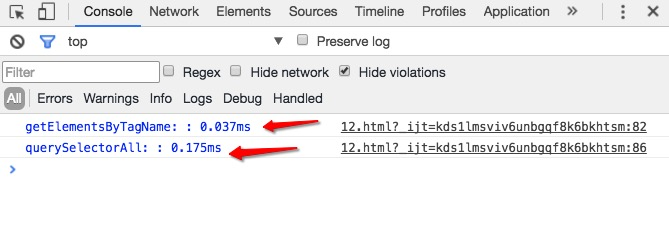
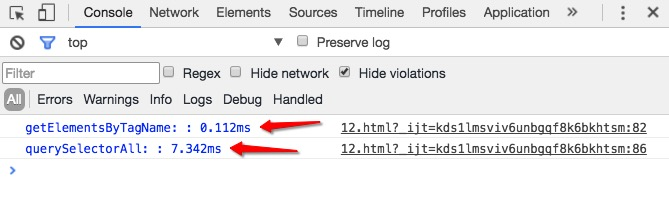

# 为什么getElementsByTagName比querySelectorAll方法快

> 作者：dreamapple | 技术风暴

最近准备把JavaScript的许多原生API都研究一下，恰巧昨天在看`querySelectorAll`方法的时候看到了一篇文章[Why is getElementsByTagName() faster than querySelectorAll()?][1]，这篇文章解释了为什么`getElementsByTagName`方法比`querySelectorAll`方法快的原因，如果你英语不错的话，推荐你看看原文。当然如果你不想看的话，继续把这篇文章看完也是可以得到答案的。

在看到那篇文章之前，我对这方面也没有深入的了解过；所以决定花费一番功夫好好地探究一下。首先在开始之前，我们要先做一些基本的功课：  
<br />
## `HTMLCollection`与`NodeList`的区别
<br/>

`HTMLCollection`和`NodeList`都是`DOM`的节点集合；但是它们两个能够包含的元素是不太一样的，`HTMLCollection`只可以包含`HTML`元素(`Element`)集合，`NodeList`可以包含任意的节点类型，就是说`NodeList`不仅可以包含`HTML`元素集合，也可以包含像文字节点，注释节点等类型的节点集合。 我们可以看下面一个例子：

```html
<!-- HTML部分 -->
<div id="test" name="test">
    <!-- 注释部分 -->
    测试用例
    <p>p标签内容</p>
</div>
<form name="form1" action="#">
    <!-- username -->
    <label for="username1">
        用户名：
        <input id="username1" type="text">
    </label>
    <!-- password -->
    <label for="password1">
        密码：
        <input id="password1" type="text">
    </label>
</form>
<form name="form2" action="#">
    <!-- username -->
    <label for="username2">
        用户名：
        <input id="username2" type="text">
    </label>
    <!-- password -->
    <label for="password2">
        密码：
        <input id="password2" type="text">
    </label>
</form>
```


```javascript
// NodeList
let test = document.getElementById('test');
let nodeList = test.childNodes;
console.log(nodeList, nodeList.length);
  
// HTMLCollection
let allForms = document.forms;
console.log(allForms, allForms.length);
```

我们看一下控制台的输出结果：  
<br/>
![NodeList和HTMLCollection的区别][2]
<center style="color:#999; font-size:0.9em">NodeList和HTMLCollection的区别</center>
<br/>
我们可以看到，`nodeList`是一个`NodeList`集合，它包含了3个`text`节点，一个`comment`节点和一个p元素节点；`allForms`是一个`HTMLCollection`集合，它只包含了两个`form`元素。  
它们两个之间还有一个不同，那就是`HTMLCollection`比`NodeList`多提供了一个`namedItem`方法，其它的方法它们两个都是相同的。当然，这里只是简单的把他们的不同点列举了出来，如果大家还想深入的了解它们，可以参考下面的资料：

- [NodeList](https://developer.mozilla.org/en-US/docs/Web/API/NodeList)
- [HTMLCollection](https://developer.mozilla.org/en-US/docs/Web/API/HTMLCollection)
- [DOM4 specification - Collections](https://dom.spec.whatwg.org/#concept-collection)  
<br/>
## 实时(`live`)的NodeList和静态(`static`)的NodeList
<br/>

- 关于`Live`NodeLists在`W3C`上面的原文解释是这样的：

> `NodeList` and `NamedNodeMap` objects in the DOM are `live`; that is, changes to the underlying document structure are `reflected` in all relevant NodeList and NamedNodeMap objects. For example, if a DOM user gets a NodeList object containing the children of an Element, then subsequently adds more children to that element (or removes children, or modifies them), those changes are `automatically reflected` in the NodeList, without further action on the user's part. Likewise, changes to a Node in the tree are reflected in all references to that Node in NodeList and NamedNodeMap objects.

上面的大概意思就是说，`DOM`中的`NodeList`是一种特殊的对象，它是实时更新的；就是你对这个`NodeList`中的`任何一个元素`进行的一些操作，都会实时的更新到这个`NodeList`对象上面。我们下面可以来实践一下：

```javascript
let body = document.getElementsByTagName('body')[0];
let liveNodeList = document.getElementsByTagName('p');
console.log(liveNodeList, liveNodeList.length);
let p = document.createElement('p');
p.innerText = 'test';
body.appendChild(p);
console.log(liveNodeList, liveNodeList.length);
```

你可以将上面的代码粘贴到浏览器空白页的控制台里，运行一下；然后你就会看到下面奇怪的结果：  
<br/>

<center style="color:#999; font-size:0.9em">实时的HTMLCollection集合</center>
<br/>
这充分说明了我们获取的`liveNodeList`是一个实时的`NodeList`或者说`HTMLCollection`,当我们第一次打印`liveNodeList`的时候，它确实是一个`length`属性为0的集合，也就是说，这个时候这个集合里面是没有元素的；但是经过后面的操作，我们添加了一个`p`元素，这个操作会实时的反映到这个对象身上。然后就会出现了上面的那种情况。  
<br/>
- 关于`Static`NodeLists在`W3C`上面的原文解释如下：

> The `NodeList` object returned by the `querySelectorAll()` method must be static, not live ([DOM-LEVEL-3-CORE], section 1.1.1). Subsequent changes to the structure of the underlying document must not be reflected in the `NodeList` object. This means that the object will instead contain a list of matching `Element` nodes that were in the document at the time the list was created.

上面的大概意思就是说，通过使用`querySelectorAll()`方法返回的`NodeList`集合必须是静态的，就是一旦获取到这个结果；那么这个结果不会因为后面再对这个集合中元素进行的操作而进行改变。我们可以改变一下上面的例子：

```javascript
let body = document.getElementsByTagName('body')[0];
// 使用querySelectorAll方法
let liveNodeList = document.querySelectorAll('p');
console.log(liveNodeList, liveNodeList.length);
let p = document.createElement('p');
p.innerText = 'test';
body.appendChild(p);
console.log(liveNodeList, liveNodeList.length);
// 再次使用querySelectorAll获取p元素集合
liveNodeList = document.querySelectorAll('p');
console.log(liveNodeList, liveNodeList.length);
```

你可以再次将上面的代码粘贴到浏览器的控制台里，运行一下；然后就会得到下面的结果：  
<br/>

<center style="color:#999; font-size:0.9em">静态的NodeList集合</center>
<br/> 
&emsp;&emsp;上面这张图片展示的结果跟我们的预期是一样的，也就是说，静态的`NodeList`集合，一旦获取到结果，就不会再次因为这个集合中的元素发生变化而发生改变。  
<br />
到目前为止，我们已经把一些需要我们了解的知识简单的了解了一下，下面我们来解释为什么getElementsByTagName比querySelectorAll方法快的原因。因为通过`getElementsByTagName`获取到的`NodeList`是一个实时的集合，这种实时的集合，是不需要在一开始的时候就获取到所有的信息的；然而通过`querySelectorAll`方法获取到的的`NodeList`集合是一个静态的集合，这个集合相当于一个快照，就是在这个方法运行的那个时间，它所要获取的集合元素的一个快照，所以这个集合要保存大量的信息，速度自然会慢下来。

为了加深理解，我们可以这样理解：**使用getElementsByTagName方法我们得到的结果就像是一个对象的索引，而通过querySelectorAll方法我们得到的是一个对象的克隆；所以当这个对象数据量非常大的时候，显然克隆这个对象所需要花费的时间是很长的。**

当然，真实的原因是因为这两个方法底层的代码实现是不一样的；实时的NodeList集合底层的代码是[DynamicNodeList.cpp][3]，静态的NodeList集合底层的代码是[ StaticNodeList.cpp][4]。

这也给我们一些启示，在以后需要用到获取元素集合的方法的时候，我们就要根据不同的场景来选择使用不同的方法了。如果你不需要一个快照，那就选择使用`getElementsByTagName`方法，如果你需要一个快照来进行复杂的CSS查询，或者复杂的DOM操作的话，那就选择使用`querySelectorAll`方法。

虽然道理明白了，但是我们还是要验证一下；结果到底是不是和我们想的那样呢？毕竟实践出真知呀，所以我们还要写个例子来测试一下：  

```javascript
let body = document.getElementsByTagName('body')[0];
for(let i = 0; i < 1e3; i++) {
    let a = document.createElement('a');
    a.innerText = i;
    body.appendChild(a);
}
console.time('getElementsByTagName: ');
let l1 = document.getElementsByTagName('a');
console.timeEnd('getElementsByTagName: ');
console.time('querySelectorAll: ');
let l2 = document.querySelectorAll('a');
console.timeEnd('querySelectorAll: ');
```

当我们向文档中添加1e3(1000)个`a`标签的时候，控制台打印的结果如下：


<center style="color:#999; font-size:0.9em">获取文档中1000个a标签</center>
<br/>
当我们向文档中添加1e4(10000)个`a`标签的时候，控制台的打印结果如下：  
<br/>

<center style="color:#999; font-size:0.9em">获取文档中10000个a标签</center>

通过上面的结果我们可以看到，随着`a`标签的数量增加，使用`querySelectorAll`方法的速度变得越来越慢，而使用`getElementsByTagName`方法速度变化并没有很大；大家也可以自己实践一下，看看结果。  
<br />
还有一点其实是需要我们注意的，我们使用的`console.time`和`console.timeEnd`方法得出来的时间并不是特别准确的；更准确的做法是使用[`Performance`][5]这个对象提供的[`now`][6]方法来进行计时。这里有一些文章关于为什么要使用`Performance`的解释：[Timing JavaScript Code with High Resolution Timestamps][7]和[Discovering the High Resolution Time API][8]，接下来我们来修改一下上面的代码：  

```javascript
let body = document.getElementsByTagName('body')[0];
for(let i = 0; i < 1e3; i++) {
    let a = document.createElement('a');
    a.innerText = i;
    body.appendChild(a);
}
let t0 = window.performance.now();
let l1 = document.getElementsByTagName('a');
let t1 = window.performance.now();
let t2 = window.performance.now();
let l2 = document.querySelectorAll('a');
let t3 = window.performance.now();
console.log("getElementsByTagName方法使用了" + (t1 - t0) + "毫秒.");
console.log("querySelectorAll方法使用了" + (t3 - t2) + "毫秒.");
```


我们运行一下上面的代码，反别试一下向页面添加1e3，1e4，1e5个`a`标签时候，这两个方法执行时间的快慢。


<center style="color:#999; font-size:0.9em">获取文档中1000个a标签</center>
<br/>

<center style="color:#999; font-size:0.9em">获取文档中10000个a标签</center>
<br/>
  
<center style="color:#999; font-size:0.9em">获取文档中100000个a标签</center>
<br/>
通过上面的结过，我们可以清楚地看到，随着`a`标签数量的增多，使用`querySelectorAll`方法会越来越慢，而使用`getElementsByTagName`方法的速度却变化不大，这也说明了`getElementsByTagName`方法确实比`querySelectorAll`方法要快。  
<br/>
到这里，我们要说明的东西基本上也就说完了；其实关于这两个方法的比较，可以在[jsPerf][9]得到权威一点的比较，大家可以看看[getElementsBy* vs querySelectorAll][10]上面的比较结果，很直观。

 
<center style="color:#999; font-size:0.9em">jsPerf上面的测试结果: Ops/Sec是指每秒执行操作的次数，越高越好 </center>
<br/>
参考的一些资料：
- [Difference between HTMLCollection, NodeLists, and arrays of objects](https://stackoverflow.com/questions/15763358/difference-between-htmlcollection-nodelists-and-arrays-of-objects)
- [Why is getElementsByTagName() faster than querySelectorAll()?](https://www.nczonline.net/blog/2010/09/28/why-is-getelementsbytagname-faster-that-queryselectorall/)


[1]: https://www.nczonline.net/blog/2010/09/28/why-is-getelementsbytagname-faster-that-queryselectorall/
[2]: ../img/whygetelement_1.png
[3]: http://trac.webkit.org/browser/trunk/WebCore/dom/DynamicNodeList.cpp
[4]: http://trac.webkit.org/browser/trunk/WebCore/dom/StaticNodeList.cpp
[5]: https://developer.mozilla.org/zh-CN/docs/Web/API/Performance
[6]: https://developer.mozilla.org/zh-CN/docs/Web/API/Performance/now
[7]: http://blog.teamtreehouse.com/timing-javascript-code-high-resolution-timestamps
[8]: https://www.sitepoint.com/discovering-the-high-resolution-time-api/
[9]: https://jsperf.com/
[10]: https://jsperf.com/getelementsby-vs-queryselectorall/7


<br/>
<Vssue />